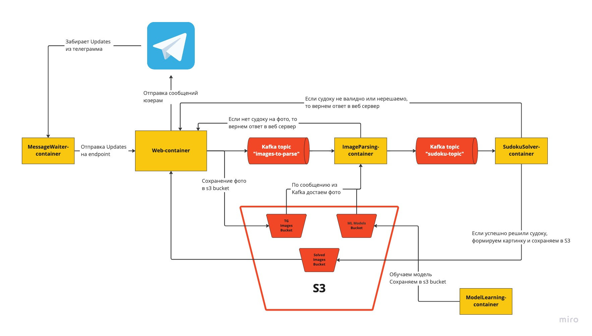
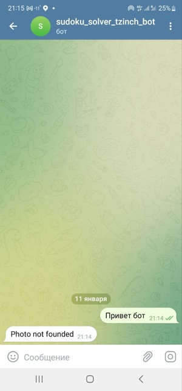
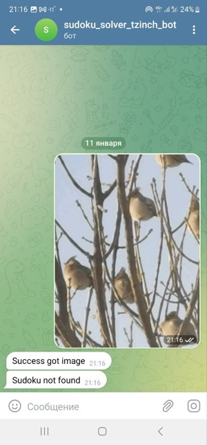
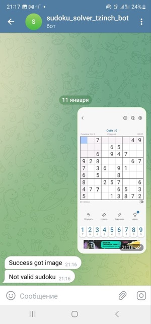
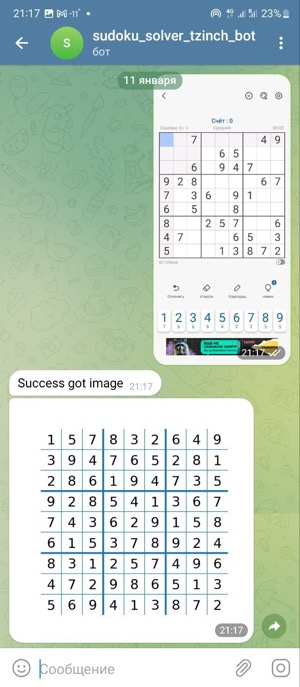

# Телеграм-бот решатель судоку (@tzinch_sudoku_bot)

#### Чтобы попробовать напишите в телеграмме боту - @tzinch_sudoku_bot

Судоку бот:
- Определяет на скришоте судоку и парсит изображение
- Решает задачу
- Формирует изображение с ответом и отправляет пользователю

## Ограничения
Модель, считывающая судоку с изображения обучена на скриншотах из приложения [Sudoku - Classic Sudoku Puzzle](https://play.google.com/store/apps/details?id=easy.sudoku.puzzle.solver.free) - топ 1 по популярности в Google PlayMarket, более 50 млн скачиваний. **Решение скриншотов из других приложений не гарантировано.**

## Архитектура

Приложение состоит из 5 микросервисов:
- **MessageWaiter** - задача этого микросервиса часто обращаться к TG Api и забирать новые сообщения, полученные ботом. Эти сообщения отправлются в Web для процессинга и формирования ответа.
- **Web** - FastApi приложение осуществляет отправку сообщений в TG со следующими endpoint'ами
    - GET `/send_sudoku?chat_id=xxx?object_id=xxx` - отправить изображение (object_id) из s3 bucket'а с готовыми изображениями в чат по chat_id
    - GET `/send_text?chat_id=xxx?text=xxx` - отправить текст (text) в чат по chat_id
    - POST `/tg_webhook` - обработка json-строки объекта `Update`.
        - Если нет в сообщении фото, то отправка пользователю ответа "Photo not founded"
        - Если фото есть, то фото сохраняется в s3, и в топик Kafka отправляется путь к этому фото в s3 для обработки
    - GET `parse_last_message` - для локального тестирования, метод делает идентичную tg_webhook обработку последнего сообщения
- **ModelLearning** - этот микросервис запускается одним из самых первых, и обучает модель определения цифр на датасете собранном из скриншотов. После обучения модели сохраняет ее в s3, затем завершает работу.
- **image_parser** - занимается извлечением задачи судоку из фото
    - При инициализации подгружает модель определения цифр из s3
    - Читает топик Kafka, при получении сообщения достает фото из S3 и производит ее обработку
    - Если на фото получилось найти судоку, то отправляется массив цифр в топик Kafka для микросервиса sudoku_solver
    - Если на фото нет судоку, то отправляется запрос в web на эндпоинт send_text с текстом "Sudoku not found"
- **sudoku_solver** - микросервис решения судоку
    - Из топика Kafka читается задача
    - Происходит ее валидация (проверка что 81 ячейка, все цифры от 1 до 9, нет дублей по строкам, по столбцам, по квадрантам 3х3).  
        Если задача не валидна, то отправляется запрос в web на эндпоинт send_text с текстом "Not valid sudoku"
    - Далее происходит решение этой задачи.
        Если не получилось решить, то отправляется запрос в web на эндпоинт send_text с текстом "Didn't found how to solve it"
    - Если успешно решили задачу, то формируем изображение и сохраняем его в s3. отправляется запрос в web на эндпоинт send_sudoku.

## Как запустить локально

1. Нужно создать бота в телеграмме и получить к нему токен
2. В папке с этим файлов лежат файлы `***_env_example` нужно создать идентичные файлы без постфикса example (то есть `***_env`).  
    Затем заменить XXX в этих файлах на выбранные вами пароли / логины / названия топиков
3. `docker-compose up`

## Примеры общения с ботом

#### Чтобы попробовать напишите в телеграмме боту - @tzinch_sudoku_bot

#### Отправка сообщения без фото

#### Отправка фото без судоку

#### Отправка невалидного судоку (две цифры 7 в предпоследней строке)

#### Отправка судоку
